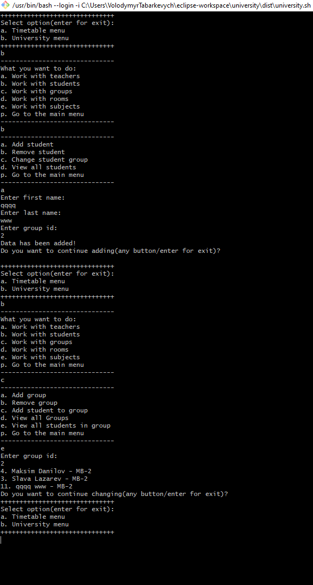
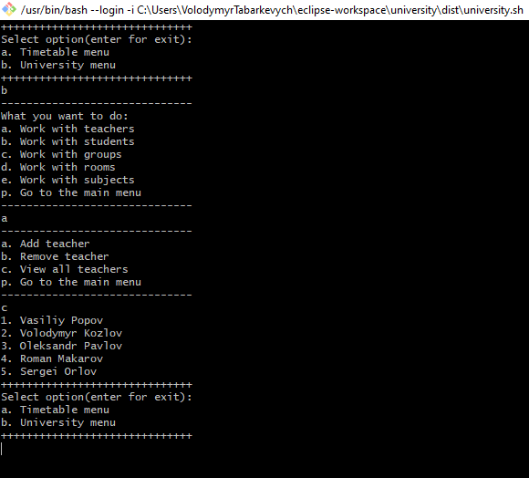
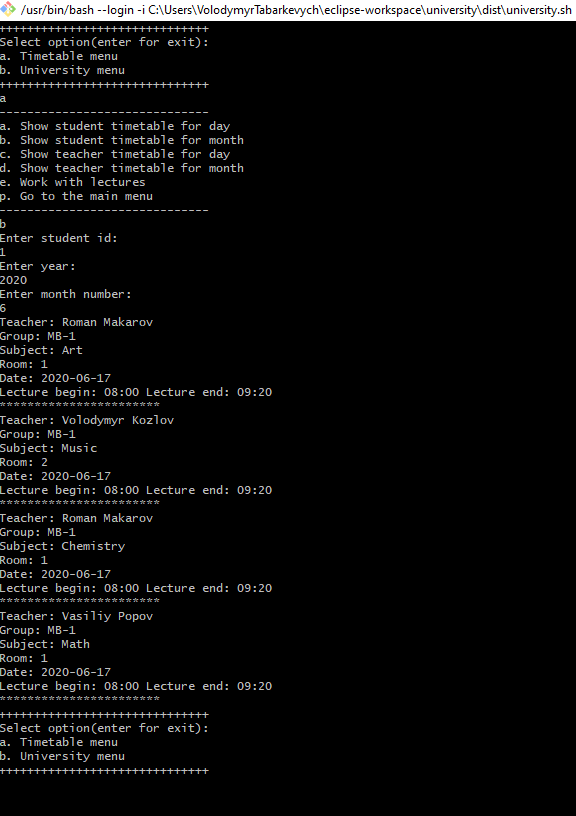
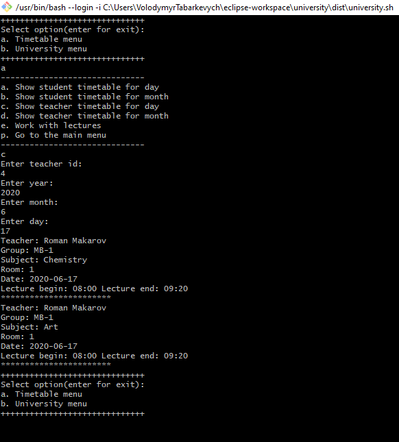

Task 18 - Spring Boot

Convert application to Spring Boot. 

You should use Spring IoC.

https://lms.foxminded.com.ua/mod/assign/view.php?id=39

### Required technologies:
1. Java 1.8 or newer version, Docker.
2. Windows, Mac, or Linux.

### How to run the project:
1. Run make.sh to create jar file.
2. Run make-db.sh to create docker image with database(before your run this script be sure that your docker is running).
3. In dist folder run univerisity-db.sh. This script will run docker image with database.
4. In dist folder run univerisity.sh. This script will run the program.

### Examples of running the project
Add new student:

View all teachers:

View teacher timetable for month:

View student timetable for day:

